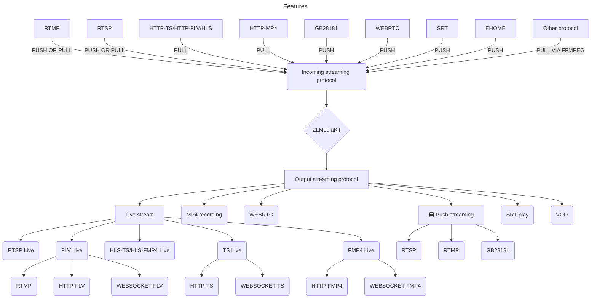

# An high-performance, enterprise-level streaming media service framework based on C++11.

[](https://github.com/ZLMediaKit/ZLMediaKit/blob/master/LICENSE)
[](https://en.cppreference.com/)
[](https://github.com/ZLMediaKit/ZLMediaKit)
[](https://github.com/ZLMediaKit/ZLMediaKit/pulls)

[](https://github.com/ZLMediaKit/ZLMediaKit)
[](https://github.com/ZLMediaKit/ZLMediaKit)
[](https://github.com/ZLMediaKit/ZLMediaKit)
[](https://github.com/ZLMediaKit/ZLMediaKit)

[](https://hub.docker.com/r/zlmediakit/zlmediakit/tags)
[](https://hub.docker.com/r/zlmediakit/zlmediakit/tags)

## Project Features

- Developed with C++11, avoiding the use of raw pointers, providing stable and reliable code with superior performance.
- Supports multiple protocols (RTSP/RTMP/HLS/HTTP-FLV/WebSocket-FLV/GB28181/HTTP-TS/WebSocket-TS/HTTP-fMP4/WebSocket-fMP4/MP4/WebRTC), and protocol conversion.
- Developed with multiplexing/multithreading/asynchronous network IO models, providing excellent concurrency performance and supporting massive client connections.
- The code has undergone extensive stability and performance testing, and has been extensively used in production environments.
- Supports all major platforms, including linux, macos, ios, android, and windows.
- Supports multiple instruction set platforms, such as x86, arm, risc-v, mips, Loongson, and Shenwei.
- Provides ultra-fast startup, extremely low latency ([within 500 milliseconds, and can be as low as 100 milliseconds](../reference/test/delay_test.md)), and excellent user experience.
- Provides a comprehensive standard [C API](https://github.com/ZLMediaKit/ZLMediaKit/tree/master/api/include) that can be used as an SDK or called by other languages.
- Provides a complete [MediaServer](https://github.com/ZLMediaKit/ZLMediaKit/tree/master/server) server, which can be deployed directly as a commercial server without additional development.
- Provides a complete [restful api](./media_server/restful_api.md) and [web hook](./media_server/web_hook_api.md), supporting rich business logic.
- Bridges the video surveillance protocol stack and the live streaming protocol stack, and provides comprehensive support for RTSP/RTMP.
- Fully supports H265/H264/AAC/G711/OPUS.
- Provides complete functions, including clustering, on-demand protocol conversion, on-demand push/pull streams, playback before publishing, and continuous publishing after disconnection.
- Provides ultimate performance, supporting 10W-level players on a single machine and 100Gb/s-level IO bandwidth capability.
- Provides ultimate user experience with [exclusive features](../reference/documents/exclusive_features.md).
- [Who is using zlmediakit?](https://github.com/ZLMediaKit/ZLMediaKit/issues/511)
- Fully supports IPv6 networks.

## Project Positioning

- Cross-platform streaming media solution for mobile and embedded systems.
- Commercial-grade streaming media server.
- Network programming secondary development SDK.

## Feature List

### Overview of Features



- RTSP\[S\]

  - RTSP\[S\] server, supports RTMP/MP4/HLS to RTSP\[S\] conversion, supports devices such as Amazon Echo Show
  - RTSP\[S\] player, supports RTSP proxy, supports generating silent audio
  - RTSP\[S\] push client and server
  - Supports four RTP transmission modes: `rtp over udp` `rtp over tcp` `rtp over http` `rtp multicast`
  - Server/client fully supports Basic/Digest authentication, asynchronous configurable authentication interface
  - Supports H265 encoding
  - The server supports RTSP pushing (including `rtp over udp` and `rtp over tcp`)
  - Supports H264/H265/AAC/G711/OPUS/MJPEG encoding. Other encodings can be forwarded but cannot be converted to protocol

- RTMP\[S\]

  - RTMP\[S\] playback server, supports RTSP/MP4/HLS to RTMP conversion
  - RTMP\[S\] publishing server, supports recording and publishing streams
  - RTMP\[S\] player, supports RTMP proxy, supports generating silent audio
  - RTMP\[S\] push client
  - Supports http\[s\]-flv live streaming server
  - Supports http\[s\]-flv live streaming player
  - Supports websocket-flv live streaming
  - Supports H264/H265/AAC/G711/OPUS encoding. Other encodings can be forwarded but cannot be converted to protocol
  - Supports [RTMP-H265](https://github.com/ksvc/FFmpeg/wiki)
  - Supports [RTMP-OPUS](../reference/resources/rtmp_support_for_h265_and_opus.md)
  - Supports [enhanced-rtmp(H265)](https://github.com/veovera/enhanced-rtmp)

- HLS

  - Supports HLS file(mpegts/fmp4) generation and comes with an HTTP file server
  - Through cookie tracking technology, it can simulate HLS playback as a long connection, which can achieve HLS on-demand pulling, playback statistics, and other businesses
  - Supports HLS player and can pull HLS to rtsp/rtmp/mp4
  - Supports H264/H265/AAC/G711/OPUS encoding

- TS

  - Supports http\[s\]-ts live streaming
  - Supports ws\[s\]-ts live streaming
  - Supports H264/H265/AAC/G711/OPUS encoding

- fMP4

  - Supports http\[s\]-fmp4 live streaming
  - Supports ws\[s\]-fmp4 live streaming
  - Supports H264/H265/AAC/G711/OPUS/MJPEG encoding

- http\[s\] and WebSocket

  - The server supports `directory index generation`, `file download`, `form submission requests`
  - The client provides `file downloader (supports resume breakpoint)`, `interface requestor`, `file uploader`
  - Complete HTTP API server, which can be used as a web backend development framework
  - Supports cross-domain access
  - Supports http client/server cookie
  - Supports WebSocket server and client
  - Supports http file access authentication

- GB28181 and RTP Streaming

  - Supports UDP/TCP RTP (PS/TS/ES) streaming server, which can be converted to RTSP/RTMP/HLS and other protocols
  - Supports RTSP/RTMP/HLS and other protocol conversion to RTP streaming client, supports TCP/UDP mode, provides corresponding RESTful API, supports active and passive modes
  - Supports H264/H265/AAC/G711/OPUS encoding
  - Supports ES/PS/TS/EHOME RTP streaming
  - Supports ES/PS RTP forwarding
  - Supports GB28181 active pull mode
  - Supports two-way voice intercom

- MP4 VOD and Recording

  - Supports recording as FLV/HLS/MP4
  - Supports MP4 file playback for RTSP/RTMP/HTTP-FLV/WS-FLV, supports seek
  - Supports H264/H265/AAC/G711/OPUS encoding

- WebRTC
  - Supports WebRTC streaming and conversion to other protocols
  - Supports WebRTC playback and conversion from other protocols to WebRTC
  - Supports two-way echo testing
  - Supports simulcast streaming
  - Supports uplink and downlink RTX/NACK packet loss retransmission
  - **Supports single-port, multi-threaded, and client network connection migration (unique in the open source community)**.
  - Supports TWCC RTCP dynamic rate control
  - Supports REMB/PLI/SR/RR RTCP
  - Supports RTP extension parsing
  - Supports GOP buffer and instant WebRTC playback
  - Supports data channels
  - Supports WebRTC over TCP mode
  - Excellent NACK and jitter buffer algorithms with outstanding packet loss resistance
  - Supports WHIP/WHEP protocols
- [SRT support](./protocol/srt/README.md)
- Others
  - Supports rich RESTful APIs and webhook events
  - Supports simple Telnet debugging
  - Supports hot reloading of configuration files
  - Supports traffic statistics, stream authentication, and other events
  - Supports virtual hosts for isolating different domain names
  - Supports on-demand streaming and automatic shutdown of streams with no viewers
  - Supports pre-play before streaming to increase the rate of timely stream openings
  - Provides a complete and powerful C API SDK
  - Supports FFmpeg stream proxy for any format
  - Supports HTTP API for real-time screenshot generation and return
  - Supports on-demand demultiplexing and protocol conversion, reducing CPU usage by only enabling it when someone is watching
  - Supports cluster deployment in traceable mode, with RTSP/RTMP/HLS/HTTP-TS support for traceable mode and HLS support for edge stations and multiple sources for source stations (using round-robin tracing)
  - Can reconnect to streaming after abnormal disconnection in RTSP/RTMP/WebRTC pushing within a timeout period, with no impact on the player.

## How to build

It is recommended to compile on Ubuntu or macOS. Compiling on Windows is cumbersome, and some features are not compiled by default.
[For details, please refer to Quick Start](../tutorial/README.md)

## How to use

You have three ways to use ZLMediaKit, namely:

- 1. Use c api as sdk, please refer to [here](https://github.com/ZLMediaKit/ZLMediaKit/tree/master/api/include).
- 2. Used as an independent streaming media server. If you don’t want to do c/c++ development, you can refer to [restful api](./media_server/restful_api.md) and [web hook](./media_server/web_hook_api.md).
- 3. If you want to do c/c++ development and add business logic to increase functions, you can refer to the [test program] here (https://github.com/ZLMediaKit/ZLMediaKit/tree/master/tests).

## Docker image

You can download the compiled image from Docker Hub and start it:

This image is automatically compiled and pushed for github continuous integration, keeping it up to date with the code (master branch)

```bash
docker run -id -p 1935:1935 -p 8080:80 -p 8443:443 -p 8554:554 -p 10000:10000 -p 10000:10000/udp -p 8000:8000/udp -p 9000:9000/udp zlmediakit/zlmediakit:master
```

You can also compile the image according to the Dockerfile:

```bash
bash build_docker_images.sh
```
