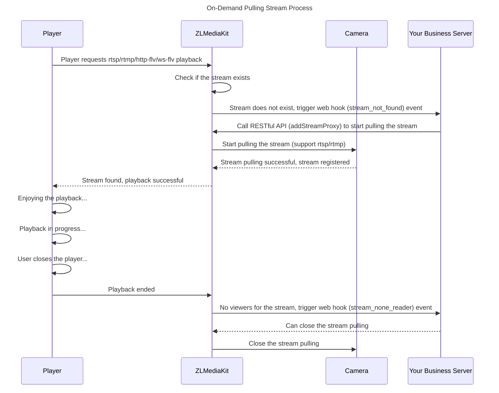
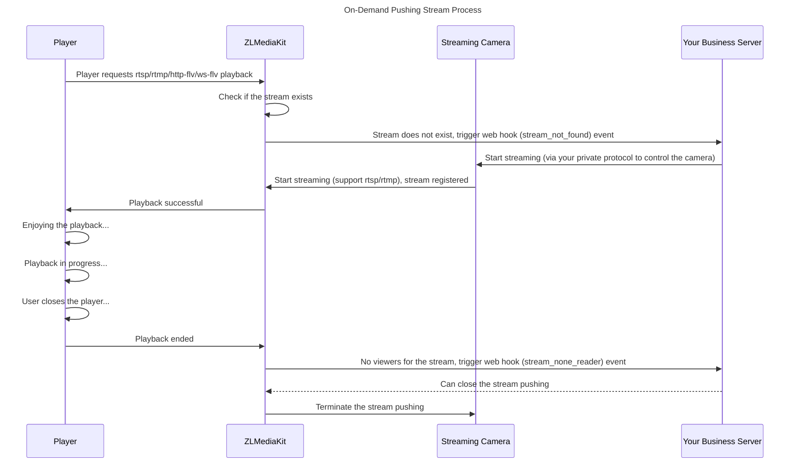
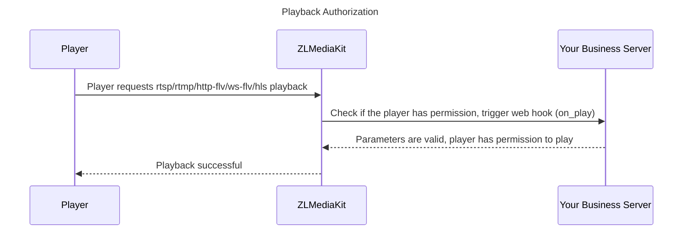
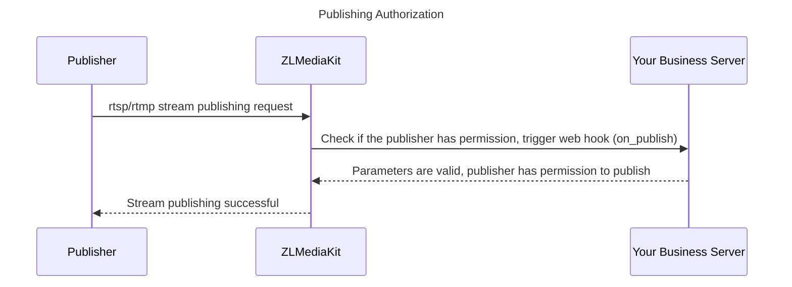

```mermaid
---
title: On-Demand Pulling Stream Process
---
sequenceDiagram
    participant Player
    participant ZLMediaKit
    participant Camera
    participant Your Business Server

    Player ->> ZLMediaKit: Player requests rtsp/rtmp/http-flv/ws-flv playback
    ZLMediaKit ->> ZLMediaKit: Check if the stream exists
    ZLMediaKit ->> Your Business Server: Stream does not exist, trigger web hook (stream_not_found) event
    Your Business Server ->> ZLMediaKit: Call RESTful API (addStreamProxy) to start pulling the stream
    ZLMediaKit ->> Camera: Start pulling the stream (support rtsp/rtmp)
    Camera -->> ZLMediaKit: Stream pulling successful, stream registered
    ZLMediaKit -->> Player: Stream found, playback successful
    Player ->> Player: Enjoying the playback...
    Player ->> Player: Playback in progress...
    Player ->> Player: User closes the player...
    Player ->> ZLMediaKit: Playback ended
    ZLMediaKit ->> Your Business Server: No viewers for the stream, trigger web hook (stream_none_reader) event
    Your Business Server -->> ZLMediaKit: Can close the stream pulling
    ZLMediaKit ->> Camera: Close the stream pulling
```

```mermaid
---
title: On-Demand Pushing Stream Process
---
sequenceDiagram
    participant Player
    participant ZLMediaKit
    participant Streaming Camera
    participant Your Business Server

    Player ->> ZLMediaKit: Player requests rtsp/rtmp/http-flv/ws-flv playback
    ZLMediaKit ->> ZLMediaKit: Check if the stream exists
    ZLMediaKit ->> Your Business Server: Stream does not exist, trigger web hook (stream_not_found) event
    Your Business Server ->> Streaming Camera: Start streaming (via your private protocol to control the camera)
    Streaming Camera ->> ZLMediaKit: Start streaming (support rtsp/rtmp), stream registered
    ZLMediaKit ->> Player: Playback successful
    Player ->> Player: Enjoying the playback...
    Player ->> Player: Playback in progress...
    Player ->> Player: User closes the player...
    Player ->> ZLMediaKit: Playback ended
    ZLMediaKit ->> Your Business Server: No viewers for the stream, trigger web hook (stream_none_reader) event
    Your Business Server -->> ZLMediaKit: Can close the stream pushing
    ZLMediaKit ->> Streaming Camera: Terminate the stream pushing
```

```mermaid
---
title: Playback Authorization
---
sequenceDiagram
    participant Player
    participant ZLMediaKit
    participant Your Business Server

    Player ->> ZLMediaKit: Player requests rtsp/rtmp/http-flv/ws-flv/hls playback
    ZLMediaKit ->> Your Business Server: Check if the player has permission, trigger web hook (on_play)
    Your Business Server -->> ZLMediaKit: Parameters are valid, player has permission to play
    ZLMediaKit -->> Player: Playback successful
```

```mermaid
---
title: Publishing Authorization
---
sequenceDiagram
    participant Publisher
    participant ZLMediaKit
    participant Your Business Server

    Publisher ->> ZLMediaKit: rtsp/rtmp stream publishing request
    ZLMediaKit ->> Your Business Server: Check if the publisher has permission, trigger web hook (on_publish)
    Your Business Server -->> ZLMediaKit: Parameters are valid, publisher has permission to publish
    ZLMediaKit -->> Publisher: Stream publishing successful
```
