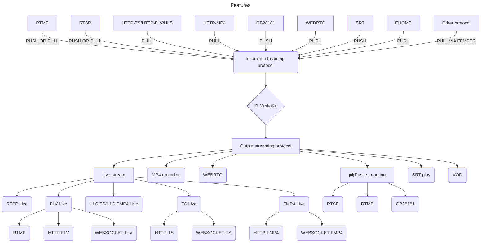

# 一个基于C++11的高性能运营级流媒体服务框架


[](https://github.com/ZLMediaKit/ZLMediaKit/blob/master/LICENSE)
[](https://en.cppreference.com/)
[](https://github.com/ZLMediaKit/ZLMediaKit)
[](https://github.com/ZLMediaKit/ZLMediaKit/pulls)

[](https://github.com/ZLMediaKit/ZLMediaKit)
[](https://github.com/ZLMediaKit/ZLMediaKit)
[](https://github.com/ZLMediaKit/ZLMediaKit)
[](https://github.com/ZLMediaKit/ZLMediaKit)

[](https://hub.docker.com/r/zlmediakit/zlmediakit/tags)
[](https://hub.docker.com/r/zlmediakit/zlmediakit/tags)

## 项目特点

- 基于C++11开发，避免使用裸指针，代码稳定可靠，性能优越。
- 支持多种协议(RTSP/RTMP/HLS/HTTP-FLV/WebSocket-FLV/GB28181/HTTP-TS/WebSocket-TS/HTTP-fMP4/WebSocket-fMP4/MP4/WebRTC),支持协议互转。
- 使用多路复用/多线程/异步网络IO模式开发，并发性能优越，支持海量客户端连接。
- 代码经过长期大量的稳定性、性能测试，已经在线上商用验证已久。
- 支持linux、macos、ios、android、windows全平台。
- 支持x86、arm、risc-v、mips、龙芯、申威等指令集平台。
- 支持画面秒开、极低延时([500毫秒内，最低可达100毫秒](../reference/test/delay_test.md))。
- 提供完善的标准[C API](https://github.com/ZLMediaKit/ZLMediaKit/tree/master/api/include),可以作SDK用，或供其他语言调用。
- 提供完整的[MediaServer](https://github.com/ZLMediaKit/ZLMediaKit/tree/master/server)服务器，可以免开发直接部署为商用服务器。
- 提供完善的[restful api](./media_server/restful_api.md)以及[web hook](./media_server/web_hook_api.md)，支持丰富的业务逻辑。
- 打通了视频监控协议栈与直播协议栈，对RTSP/RTMP支持都很完善。
- 全面支持H265/H264/AAC/G711/OPUS。
- 功能完善，支持集群、按需转协议、按需推拉流、先播后推、断连续推等功能。
- 极致性能，单机10W级别播放器，100Gb/s级别io带宽能力。
- 极致体验，[独家特性](../reference/documents/exclusive_features.md)
- [谁在使用zlmediakit?](https://github.com/ZLMediaKit/ZLMediaKit/issues/511)
- 全面支持ipv6网络

## 项目定位

- 移动嵌入式跨平台流媒体解决方案。
- 商用级流媒体服务器。
- 网络编程二次开发SDK。

## 功能清单
### 功能一览



- RTSP[S]
  - RTSP[S] 服务器，支持RTMP/MP4/HLS转RTSP[S],支持亚马逊echo show这样的设备
  - RTSP[S] 播放器，支持RTSP代理，支持生成静音音频
  - RTSP[S] 推流客户端与服务器
  - 支持 `rtp over udp` `rtp over tcp` `rtp over http` `rtp组播`  四种RTP传输方式 
  - 服务器/客户端完整支持Basic/Digest方式的登录鉴权，全异步可配置化的鉴权接口
  - 支持H265编码
  - 服务器支持RTSP推流(包括`rtp over udp` `rtp over tcp`方式)
  - 支持H264/H265/AAC/G711/OPUS/MJPEG编码，其他编码能转发但不能转协议

- RTMP[S]
  - RTMP[S] 播放服务器，支持RTSP/MP4/HLS转RTMP
  - RTMP[S] 发布服务器，支持录制发布流
  - RTMP[S] 播放器，支持RTMP代理，支持生成静音音频
  - RTMP[S] 推流客户端
  - 支持http[s]-flv直播服务器
  - 支持http[s]-flv直播播放器
  - 支持websocket-flv直播
  - 支持H264/H265/AAC/G711/OPUS编码，其他编码能转发但不能转协议
  - 支持[RTMP-H265](https://github.com/ksvc/FFmpeg/wiki)
  - 支持[RTMP-OPUS](../reference/resources/rtmp_support_for_h265_and_opus.md)
  - 支持[enhanced-rtmp(H265)](https://github.com/veovera/enhanced-rtmp)

- HLS
  - 支持HLS文件(mpegts/fmp4)生成，自带HTTP文件服务器
  - 通过cookie追踪技术，可以模拟HLS播放为长连接，可以实现HLS按需拉流、播放统计等业务
  - 支持HLS播发器，支持拉流HLS转rtsp/rtmp/mp4
  - 支持H264/H265/AAC/G711/OPUS编码
  
- TS
  - 支持http[s]-ts直播
  - 支持ws[s]-ts直播
  - 支持H264/H265/AAC/G711/OPUS编码
  
- fMP4
  - 支持http[s]-fmp4直播
  - 支持ws[s]-fmp4直播
  - 支持H264/H265/AAC/G711/OPUS/MJPEG编码

- HTTP[S]与WebSocket
  - 服务器支持`目录索引生成`,`文件下载`,`表单提交请求`
  - 客户端提供`文件下载器(支持断点续传)`,`接口请求器`,`文件上传器`
  - 完整HTTP API服务器，可以作为web后台开发框架
  - 支持跨域访问
  - 支持http客户端、服务器cookie
  - 支持WebSocket服务器和客户端
  - 支持http文件访问鉴权

- GB28181与RTP推流
  - 支持UDP/TCP RTP(PS/TS/ES)推流服务器，可以转换成RTSP/RTMP/HLS等协议
  - 支持RTSP/RTMP/HLS等协议转rtp推流客户端，支持TCP/UDP模式，提供相应restful api，支持主动被动方式
  - 支持H264/H265/AAC/G711/OPUS编码
  - 支持es/ps/ts/ehome rtp推流
  - 支持es/ps rtp转推
  - 支持GB28181主动拉流模式
  - 支持双向语音对讲

- MP4点播与录制
  - 支持录制为FLV/HLS/MP4
  - RTSP/RTMP/HTTP-FLV/WS-FLV支持MP4文件点播，支持seek
  - 支持H264/H265/AAC/G711/OPUS编码
  
- WebRTC
  - 支持WebRTC推流，支持转其他协议
  - 支持WebRTC播放，支持其他协议转WebRTC
  - 支持双向echo test     
  - 支持simulcast推流
  - 支持上下行rtx/nack丢包重传
  - **支持单端口、多线程、客户端网络连接迁移(开源界唯一)**。
  - 支持TWCC rtcp动态调整码率
  - 支持remb/pli/sr/rr rtcp
  - 支持rtp扩展解析
  - 支持GOP缓冲，webrtc播放秒开
  - 支持datachannel
  - 支持webrtc over tcp模式
  - 优秀的nack、jitter buffer算法, 抗丢包能力卓越
  - 支持whip/whep协议
- [SRT支持](./protocol/srt/README.md)
- 其他
  - 支持丰富的restful api以及web hook事件 
  - 支持简单的telnet调试
  - 支持配置文件热加载
  - 支持流量统计、推拉流鉴权等事件
  - 支持虚拟主机,可以隔离不同域名
  - 支持按需拉流，无人观看自动关断拉流
  - 支持先播放后推流，提高及时推流画面打开率
  - 提供完整强大的c api sdk
  - 支持FFmpeg拉流代理任意格式的流
  - 支持http api生成并返回实时截图
  - 支持按需解复用、转协议，当有人观看时才开启转协议，降低cpu占用率
  - 支持溯源模式的集群部署，溯源方式支持rtsp/rtmp/hls/http-ts, 边沿站支持hls, 源站支持多个(采用round robin方式溯源)
  - rtsp/rtmp/webrtc推流异常断开后，可以在超时时间内重连推流，播放器无感知
  

## 编译以及测试
**编译前务必仔细参考wiki:[快速开始](../tutorial/README.md)操作!!!**

## 怎么使用

 你有三种方法使用ZLMediaKit，分别是：

 - 1、使用c api，作为sdk使用，请参考[这里](https://github.com/ZLMediaKit/ZLMediaKit/tree/master/api/include).
 - 2、作为独立的流媒体服务器使用，不想做c/c++开发的，可以参考 [restful api](./media_server/restful_api.md) 和 [web hook](./media_server/web_hook_api.md).
 - 3、如果想做c/c++开发，添加业务逻辑增加功能，可以参考这里的[测试程序](https://github.com/ZLMediaKit/ZLMediaKit/tree/master/tests).

## Docker 镜像

你可以从Docker Hub下载已经编译好的镜像并启动它：

```bash
#此镜像为github持续集成自动编译推送，跟代码(master分支)保持最新状态
docker run -id -p 1935:1935 -p 8080:80 -p 8443:443 -p 8554:554 -p 10000:10000 -p 10000:10000/udp -p 8000:8000/udp -p 9000:9000/udp zlmediakit/zlmediakit:master
```

你也可以根据Dockerfile编译镜像：

```bash
bash build_docker_images.sh
```
