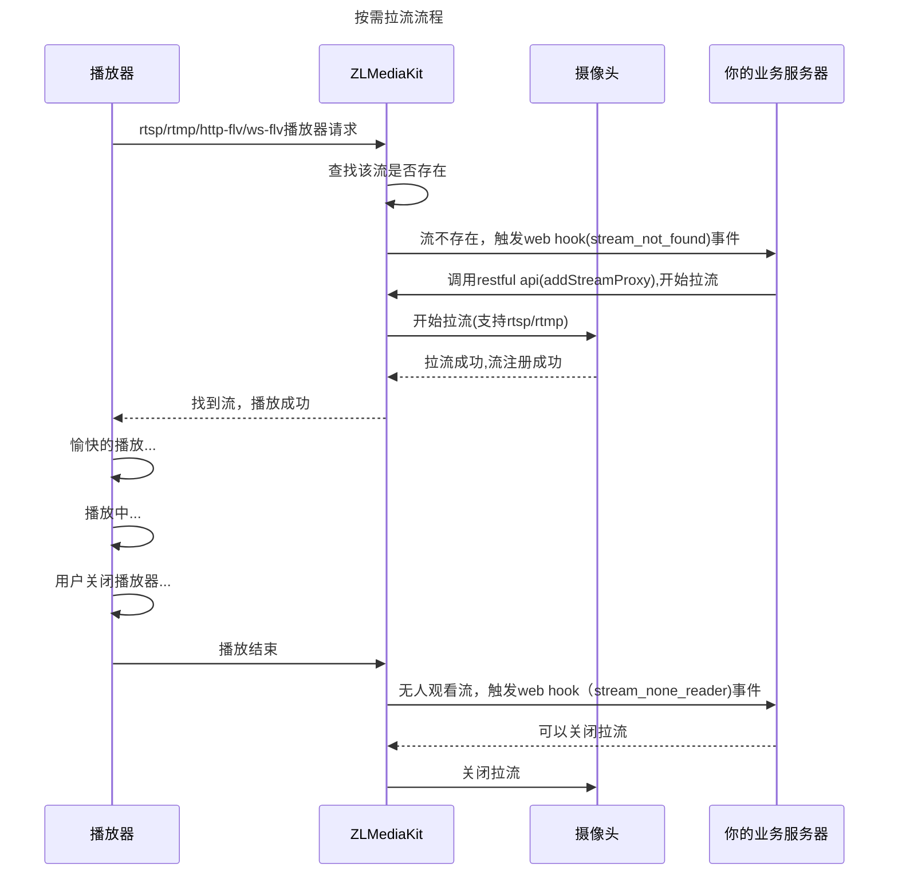
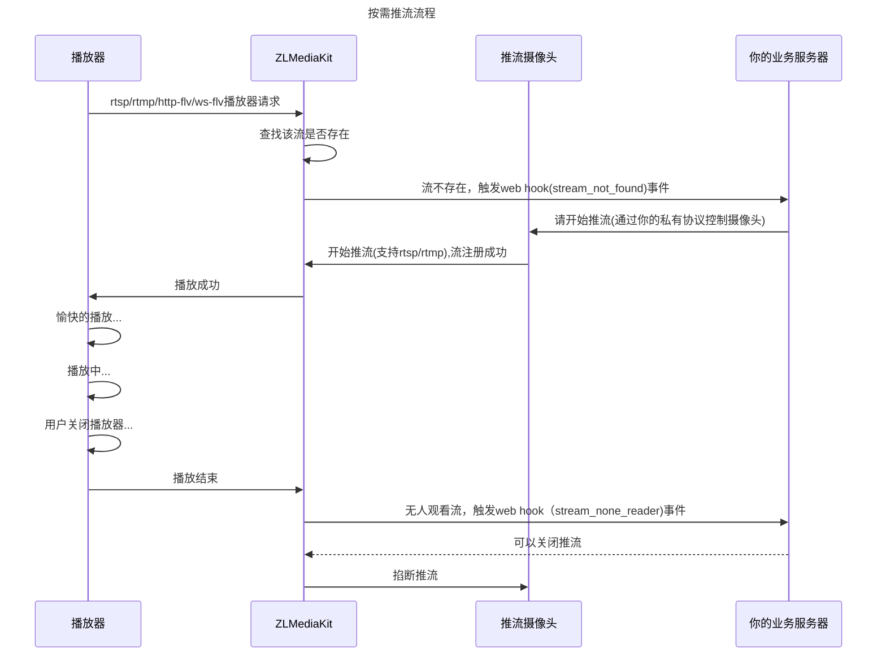
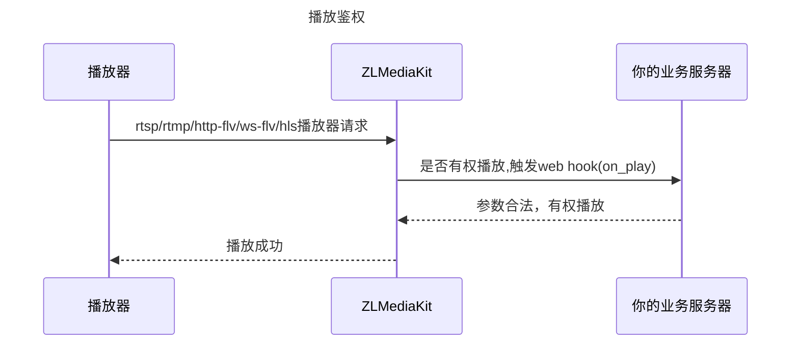
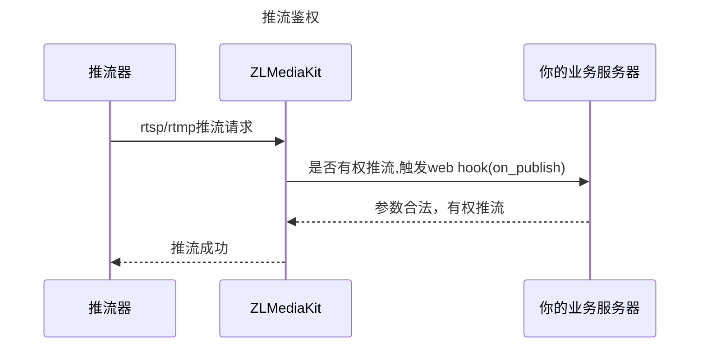

```mermaid
---
title: 按需拉流流程
---
sequenceDiagram 
    participant 播放器
    participant ZLMediaKit
    participant 摄像头
    participant 你的业务服务器
    
    播放器 ->> ZLMediaKit : rtsp/rtmp/http-flv/ws-flv播放器请求
    ZLMediaKit ->> ZLMediaKit:查找该流是否存在
    ZLMediaKit ->> 你的业务服务器: 流不存在，触发web hook(stream_not_found)事件
    你的业务服务器 ->> ZLMediaKit:调用restful api(addStreamProxy),开始拉流
    ZLMediaKit ->> 摄像头:开始拉流(支持rtsp/rtmp)
    摄像头 -->> ZLMediaKit:拉流成功,流注册成功
    ZLMediaKit -->> 播放器:找到流，播放成功
    播放器 ->> 播放器:愉快的播放...
    播放器 ->> 播放器:播放中...
    播放器 ->> 播放器:用户关闭播放器...
    播放器 ->> ZLMediaKit:播放结束
    ZLMediaKit ->> 你的业务服务器:无人观看流，触发web hook（stream_none_reader)事件
    你的业务服务器 -->>ZLMediaKit:可以关闭拉流
    ZLMediaKit ->> 摄像头:关闭拉流
```

```mermaid
---
title: 按需推流流程
---
sequenceDiagram
    participant 播放器
    participant ZLMediaKit
    participant 推流摄像头
    participant 你的业务服务器
    
    播放器 ->> ZLMediaKit : rtsp/rtmp/http-flv/ws-flv播放器请求
    ZLMediaKit ->> ZLMediaKit:查找该流是否存在
    ZLMediaKit ->> 你的业务服务器: 流不存在，触发web hook(stream_not_found)事件
    你的业务服务器 ->> 推流摄像头:请开始推流(通过你的私有协议控制摄像头)
    推流摄像头 ->> ZLMediaKit:开始推流(支持rtsp/rtmp),流注册成功
    ZLMediaKit ->> 播放器:播放成功
    播放器 ->> 播放器:愉快的播放...
    播放器 ->> 播放器:播放中...
    播放器 ->> 播放器:用户关闭播放器...
    播放器 ->> ZLMediaKit:播放结束
    ZLMediaKit ->> 你的业务服务器:无人观看流，触发web hook（stream_none_reader)事件
    你的业务服务器 -->>ZLMediaKit:可以关闭推流
    ZLMediaKit ->> 推流摄像头:掐断推流  
```

```mermaid
---
title: 播放鉴权
---
sequenceDiagram
    participant 播放器
    participant ZLMediaKit
    participant 你的业务服务器
    
    播放器 ->> ZLMediaKit : rtsp/rtmp/http-flv/ws-flv/hls播放器请求
    ZLMediaKit ->> 你的业务服务器: 是否有权播放,触发web hook(on_play)
    你的业务服务器 -->> ZLMediaKit:参数合法，有权播放
    ZLMediaKit -->> 播放器:播放成功
```

```mermaid
---
title: 推流鉴权
---
sequenceDiagram
    participant 推流器
    participant ZLMediaKit
    participant 你的业务服务器
    
    推流器 ->> ZLMediaKit : rtsp/rtmp推流请求
    ZLMediaKit ->> 你的业务服务器: 是否有权推流,触发web hook(on_publish)
    你的业务服务器 -->> ZLMediaKit:参数合法，有权推流
    ZLMediaKit -->> 推流器:推流成功
```
